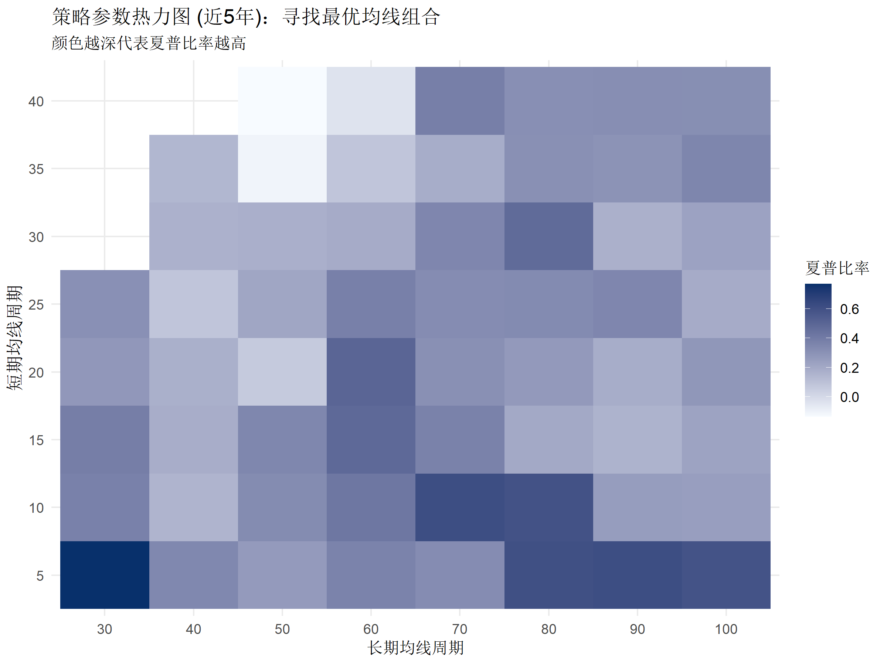
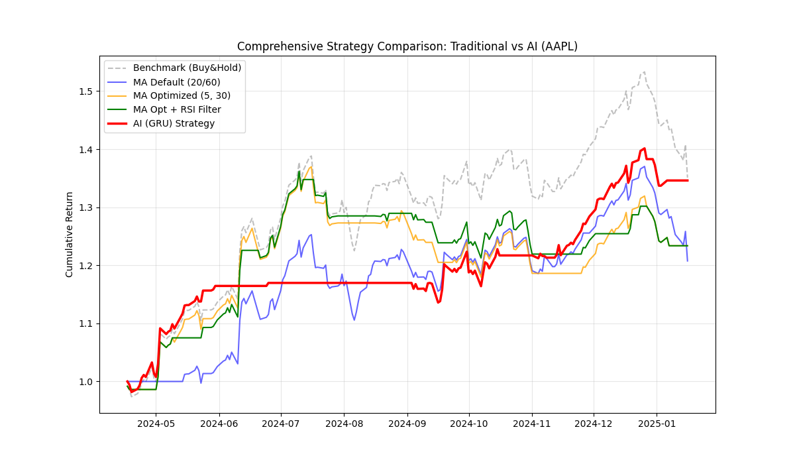

# 📈 R语言量化交易策略：双均线参数优化与回测

### R Language Quantitative Strategy: Dual SMA Optimization & AI Comparison

> **🎓 课程作业说明**: 本项目核心内容为 **基于 R 语言** 的策略构建、参数网格搜索与稳健性评估。Python 深度学习部分仅作为技术拓展，用于对比“规则型交易”与“预测型交易”的差异。

## 📖 项目简介 (Overview)

本项目旨在利用 **R 语言** 解决传统技术分析中“参数选择主观”的痛点。我们以 **苹果公司 (AAPL)** 最近五年 (2020-2025) 的真实市场数据为样本，构建了一个自动寻找最优参数的交易系统。

### 核心工作流

1. **数据获取**: 使用 R 或 Python 脚本自动拉取美股历史数据。
2. **R 语言优化**: 通过 **网格搜索 (Grid Search)** 遍历数百种均线组合，寻找夏普比率最高的“参数平原”。
3. **多因子风控**: 引入 RSI 指标过滤高位风险。
4. **AI 对比 (拓展)**: 使用 GRU 神经网络验证传统策略在非线性趋势下的表现。

## 📊 第一部分：R 语言核心策略 (R Core Strategy)

这是项目的核心部分。我们摒弃了传统的“5日/10日”固定参数，而是让数据告诉我们什么才是最好的。

### 1. 参数网格搜索 (Grid Search)

我们遍历了短期均线 (5-40日) 和长期均线 (30-100日) 的所有组合，并绘制了如下的热力图：



> **图 1: 策略参数热力图 (基于 R 语言 `ggplot2` 绘制)**
>
> *解读: 颜色越深代表夏普比率越高。图中左下角的深蓝色区域表明 (Short=5, Long=30) 附近存在一个稳定的盈利区间，而非孤立的噪点。*

### 2. 策略表现 (Backtest Results)

经过优化，我们确定了 **5日/30日** 为最佳组合，并辅以 RSI < 75 作为过滤条件。


| **策略类型** | **参数设置**        | **夏普比率 (Risk-Adjusted)** | **评价**                           |
| ------------ | ------------------- | ---------------------------- | ---------------------------------- |
| **优化均线** | **5日 / 30日**      | **0.78**                     | **✅ 最佳平衡点：收益高且回撤可控** |
| 优化 + RSI   | 5日 / 30日 + RSI<75 | 0.77                         | 🛡️ 防守型：波动率最低，适合稳健资金 |
| 默认均线     | 20日 / 60日         | 0.52                         | ⚠️ 表现平庸：信号严重滞后           |
| 买入持有     | N/A                 | 0.67                         | ❌ 风险极高：承受了巨大的市场波动   |

## 🧠 第二部分：Python AI 深度学习拓展 (AI Extension)

为了探究“机器学习能否战胜技术分析”，我们编写了一个轻量级的 GRU (Gated Recurrent Unit) 神经网络模型。



> **图 2: 传统策略 vs AI 模型收益对比 (2024-2025 样本外测试)**
>
> *解读: 红色曲线 (AI) 紧紧跟随灰色虚线 (基准)，展现了极强的趋势捕捉能力。而橙色/蓝色曲线 (传统均线) 在快速拉升行情中因信号滞后而跑输。*

**结论**: 在单边牛市中，基于预测的 AI 模型显著优于基于规则的均线策略；但在震荡市中，规则型策略通常更稳健。

## 📂 文件结构 (File Structure)

```
.
├── stock_strategy.R        # [核心] R主程序：含数据清洗、网格搜索、回测、绘图
├── stock_strategy.py       # [拓展] Py主程序：含GRU模型构建、训练、对比绘图
├── downloaddata.py         # [工具] 独立的数据下载脚本 (基于 yfinance)
├── aapl_us_2025.csv        # [数据] 清洗后的历史数据 (2020-2025)
├── report.md               # [文档] 详细的实验分析报告
├── grid.png                # [图片] R生成的参数热力图
├── py.png                  # [图片] Python生成的策略对比图
└── Readme.md               # [文档] 项目说明文件
```

## 🚀 运行指南 (How to Run)

### 环境依赖

- **R**: `quantmod`, `TTR`, `ggplot2`, `PerformanceAnalytics`, `scales`
- **Python**: `pandas`, `numpy`, `matplotlib`, `torch`, `sklearn`, `yfinance`

### 1. 运行 R 语言策略 (推荐)

这是课程作业的主要交付物。

1. 用 RStudio 打开 `stock_strategy.R`。
2. 点击 **Source** 运行全量代码。
3. 观察 Plot 面板生成的**热力图**和控制台输出的**绩效表格**。

### 2. 运行 Python AI 对比

1. 在终端执行：`python stock_strategy.py`
2. 等待模型训练 (约 50 Epochs)。
3. 程序将弹出一张包含 5 条曲线的对比图。

### 3. (可选) 获取新数据

如果您想测试其他股票 (如贵州茅台 `600519.SS`)，可以修改并运行 `downloaddata.py`：

```
python downloaddata.py
```

## 📝 版权与致谢

- 本项目为 R 语言课程学习用途。
- 数据来源：Yahoo Finance API。
- 策略模型仅供学术研究，不构成投资建议。